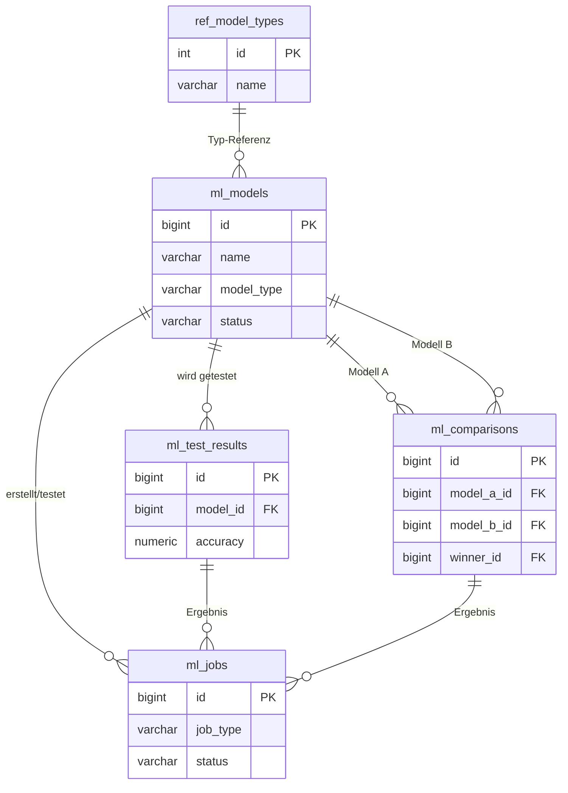
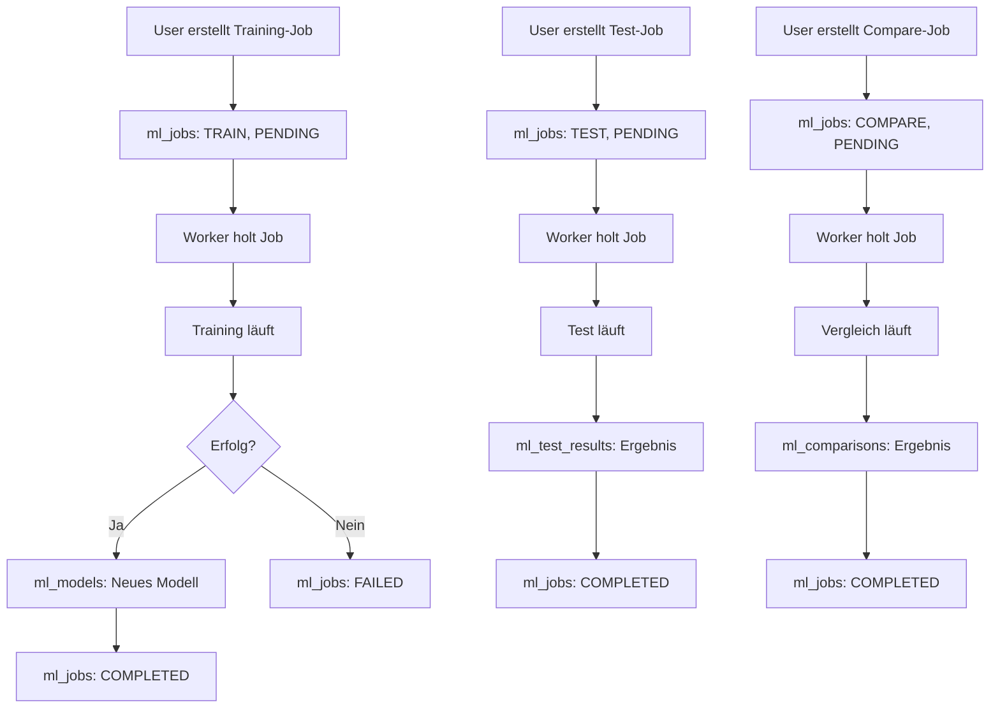

# 📊 ML Training Service - Datenbank-Schema

**Version: 2.1 (Stand: 2024-12-23)**  
**Enthält: Schema-Verbesserungen Phase 1 (CHECK Constraints, Performance-Indizes)**

## 📋 Übersicht

**5 Tabellen, 4NF-konform, JSONB für flexible Daten**

### ✅ Verbesserungen (Phase 1):
- **CHECK Constraints** für Datenintegrität (future_minutes > 0, test_start < test_end, etc.)
- **Performance-Indizes** für häufig gefilterte/sortierte Spalten
- **Code-Validierung** erweitert, um Constraint-Fehler zu vermeiden



---

## 🔄 Workflow: Was passiert wann?



---

# 📑 Tabelle 1: `ml_models`

## Was ist das?
**Die zentrale Tabelle für alle trainierten KI-Modelle.** Jedes Modell, das du erstellst, wird hier gespeichert.

## Warum brauchen wir das?
Ohne diese Tabelle wüssten wir nicht, welche Modelle existieren, wie sie trainiert wurden und wie gut sie sind.

---

## Felder im Detail

### 🔑 Identifikation

| Feld | Typ | Beschreibung | Warum? |
|------|-----|--------------|--------|
| `id` | BIGINT | Eindeutige ID (auto-generiert) | Jedes Modell braucht eine eindeutige Nummer |
| `name` | VARCHAR(255) | Name des Modells (z.B. "PumpDetector_v1") | Du willst Modelle benennen können |
| `model_type` | VARCHAR(50) | Art des Modells | Verschiedene Algorithmen haben verschiedene Stärken |

**Erlaubte `model_type` Werte:**
- `random_forest` - Gut für Anfänger, robust
- `xgboost` - Sehr performant, braucht Tuning
- `gradient_boosting` - Ähnlich wie XGBoost
- `logistic_regression` - Einfach, schnell, interpretierbar
- `neural_network` - Komplex, braucht viele Daten

### 📊 Status

| Feld | Typ | Beschreibung | Warum? |
|------|-----|--------------|--------|
| `status` | VARCHAR(50) | Aktueller Status | Du willst wissen, ob das Modell nutzbar ist |

**Erlaubte `status` Werte:**
- `TRAINING` - Modell wird gerade trainiert
- `READY` - Modell ist fertig und nutzbar
- `FAILED` - Training ist fehlgeschlagen

### ⏰ Zeitstempel

| Feld | Typ | Beschreibung | Warum? |
|------|-----|--------------|--------|
| `created_at` | TIMESTAMP | Wann wurde das Modell erstellt? | Für Historie und Sortierung |
| `updated_at` | TIMESTAMP | Wann wurde es zuletzt geändert? | Tracking von Änderungen |
| `is_deleted` | BOOLEAN | Soft-Delete Flag | Modelle nicht wirklich löschen, nur markieren |
| `deleted_at` | TIMESTAMP | Wann wurde es "gelöscht"? | Für Audit-Trail |

### 🎯 Training-Konfiguration (Das Ziel)

**Was soll das Modell vorhersagen?**

| Feld | Typ | Beispiel | Beschreibung |
|------|-----|----------|--------------|
| `target_variable` | VARCHAR(100) | `market_cap_close` | Welche Spalte aus `coin_metrics` ist das Ziel? |
| `target_operator` | VARCHAR(10) | `>` | Vergleichsoperator |
| `target_value` | NUMERIC | `50000` | Schwellwert |

**Zusammen bedeutet das:**
- `target_variable = 'market_cap_close'`
- `target_operator = '>'`
- `target_value = 50000`

→ **"Sage voraus, ob der Market Cap über 50.000 USD steigen wird"**

### 📅 Training-Zeitraum

| Feld | Typ | Beschreibung | Warum? |
|------|-----|--------------|--------|
| `train_start` | TIMESTAMP | Beginn des Trainingszeitraums | Von wann bis wann sollen Daten genutzt werden? |
| `train_end` | TIMESTAMP | Ende des Trainingszeitraums | Wichtig für Reproduzierbarkeit |
| `test_size` | NUMERIC(3,2) | z.B. `0.2` = 20% | Wie viel % der Daten für interne Validierung? |
| `random_state` | INT | z.B. `42` | Für Reproduzierbarkeit (gleiche Zufallszahlen) |

### 📋 Listen (als CSV-Strings)

| Feld | Format | Beispiel | Beschreibung |
|------|--------|----------|--------------|
| `features_csv` | `wert1,wert2,wert3` | `"price_open,price_high,volume_sol"` | Welche Spalten aus `coin_metrics` nutzen? |
| `phases_csv` | `1,2,3` | `"1,2,3"` | Welche Coin-Phasen einbeziehen? (aus `ref_coin_phases`) |
| `params_csv` | `key=value;key=value` | `"n_estimators=100;max_depth=10"` | Modell-Hyperparameter |
| `feature_importance_csv` | `key=value;key=value` | `"price_open=0.35;volume_sol=0.25"` | Wie wichtig ist jedes Feature? (nach Training) |

**Parsing-Beispiel (Python):**
```python
features = model.features_csv.split(",")
# → ["price_open", "price_high", "volume_sol"]

params = dict(p.split("=") for p in model.params_csv.split(";"))
# → {"n_estimators": "100", "max_depth": "10"}
```

### 📈 Performance-Metriken (nach Training)

| Feld | Typ | Bereich | Beschreibung |
|------|-----|---------|--------------|
| `training_accuracy` | NUMERIC(5,4) | 0.0000 - 1.0000 | Wie oft hat das Modell richtig geraten? |
| `training_f1` | NUMERIC(5,4) | 0.0000 - 1.0000 | Balance zwischen Precision und Recall |
| `training_precision` | NUMERIC(5,4) | 0.0000 - 1.0000 | Von allen "Ja"-Vorhersagen, wie viele waren richtig? |
| `training_recall` | NUMERIC(5,4) | 0.0000 - 1.0000 | Von allen echten "Ja", wie viele wurden gefunden? |

**Erklärung der Metriken:**
- **Accuracy** = (TP + TN) / Alle → Gesamte Trefferquote
- **Precision** = TP / (TP + FP) → "Wenn ich Ja sage, wie oft stimmt es?"
- **Recall** = TP / (TP + FN) → "Wie viele Ja-Fälle habe ich gefunden?"
- **F1** = 2 × (Precision × Recall) / (Precision + Recall) → Harmonisches Mittel

### 📁 Sonstiges

| Feld | Typ | Beschreibung |
|------|-----|--------------|
| `model_file_path` | TEXT | Pfad zur gespeicherten Modell-Datei (`.pkl`) |
| `description` | TEXT | Freitext-Beschreibung/Notizen |

---

# 📑 Tabelle 2: `ml_test_results`

## Was ist das?
**Ergebnisse von Modell-Tests.** Jedes Mal, wenn du ein Modell auf neuen Daten testest, wird hier ein Eintrag erstellt.

## Warum brauchen wir das?
Du willst wissen, wie gut ein Modell auf Daten performed, die es noch nie gesehen hat.

---

## Felder im Detail

### 🔑 Identifikation

| Feld | Typ | Beschreibung |
|------|-----|--------------|
| `id` | BIGINT | Eindeutige ID |
| `model_id` | BIGINT (FK) | Welches Modell wurde getestet? |
| `created_at` | TIMESTAMP | Wann wurde der Test durchgeführt? |

### 📅 Test-Zeitraum

| Feld | Typ | Beschreibung |
|------|-----|--------------|
| `test_start` | TIMESTAMP | Beginn des Test-Zeitraums |
| `test_end` | TIMESTAMP | Ende des Test-Zeitraums |

**Wichtig:** Der Test-Zeitraum sollte sich NICHT mit dem Training-Zeitraum überschneiden!

### 📈 Performance-Metriken

| Feld | Beschreibung |
|------|--------------|
| `accuracy` | Gesamte Trefferquote |
| `f1_score` | Balance Precision/Recall |
| `precision_score` | "Wenn Ja, wie oft richtig?" |
| `recall` | "Wie viele Ja gefunden?" |
| `roc_auc` | Fläche unter ROC-Kurve (0.5 = Zufall, 1.0 = Perfekt) |

### 🔢 Confusion Matrix

**Die Confusion Matrix zeigt, wie das Modell Fehler macht:**

| Feld | Bedeutung | Beispiel |
|------|-----------|----------|
| `tp` | True Positive | Modell sagt "Ja", Realität ist "Ja" ✅ |
| `tn` | True Negative | Modell sagt "Nein", Realität ist "Nein" ✅ |
| `fp` | False Positive | Modell sagt "Ja", Realität ist "Nein" ❌ |
| `fn` | False Negative | Modell sagt "Nein", Realität ist "Ja" ❌ |

```
                    REALITÄT
                  Ja      Nein
MODELL   Ja      TP       FP
         Nein    FN       TN
```

### 📊 Sample-Informationen

| Feld | Beschreibung |
|------|--------------|
| `num_samples` | Gesamtzahl der Test-Datenpunkte |
| `num_positive` | Davon: Positive Fälle (Ja) |
| `num_negative` | Davon: Negative Fälle (Nein) |

### ⚠️ Overlap-Check

| Feld | Beschreibung |
|------|--------------|
| `has_overlap` | BOOLEAN - Überschneidet sich Test mit Training? |
| `overlap_note` | Warnung wenn ja (z.B. "15% Überschneidung") |

**Warum wichtig?** Wenn Test-Daten im Training waren, ist das Ergebnis verfälscht (Data Leakage).

### 📋 Feature Importance

| Feld | Beschreibung |
|------|--------------|
| `feature_importance_csv` | Wie wichtig war jedes Feature im Test? |

---

# 📑 Tabelle 3: `ml_comparisons`

## Was ist das?
**Vergleiche zwischen zwei Modellen.** Welches Modell ist besser?

## Warum brauchen wir das?
Du willst objektiv entscheiden, welches Modell in Produktion gehen soll.

---

## Felder im Detail

### 🔑 Identifikation

| Feld | Typ | Beschreibung |
|------|-----|--------------|
| `id` | BIGINT | Eindeutige ID |
| `created_at` | TIMESTAMP | Wann wurde verglichen? |
| `model_a_id` | BIGINT (FK) | Erstes Modell |
| `model_b_id` | BIGINT (FK) | Zweites Modell |

**Constraint:** `model_a_id != model_b_id` (kann sich nicht mit sich selbst vergleichen)

### 📅 Gemeinsamer Test-Zeitraum

| Feld | Beschreibung |
|------|--------------|
| `test_start` | Gleicher Zeitraum für beide |
| `test_end` | Gleicher Zeitraum für beide |
| `num_samples` | Anzahl Test-Datenpunkte |

**Wichtig:** Beide Modelle werden auf den GLEICHEN Daten getestet für fairen Vergleich!

### 📈 Metriken pro Modell

**Modell A:**
| Feld | Beschreibung |
|------|--------------|
| `a_accuracy` | Accuracy von Modell A |
| `a_f1` | F1-Score von Modell A |
| `a_precision` | Precision von Modell A |
| `a_recall` | Recall von Modell A |

**Modell B:**
| Feld | Beschreibung |
|------|--------------|
| `b_accuracy` | Accuracy von Modell B |
| `b_f1` | F1-Score von Modell B |
| `b_precision` | Precision von Modell B |
| `b_recall` | Recall von Modell B |

### 🏆 Gewinner

| Feld | Beschreibung |
|------|--------------|
| `winner_id` | FK zum Gewinner-Modell (oder NULL bei Unentschieden) |

---

# 📑 Tabelle 4: `ml_jobs`

## Was ist das?
**Die Warteschlange für alle Jobs.** Training, Testing, Vergleiche - alles läuft hier durch.

## Warum brauchen wir das?
- Jobs können lange dauern (Minuten bis Stunden)
- Du willst den Fortschritt sehen
- Mehrere Jobs sollen nacheinander laufen
- Bei Fehlern willst du wissen was passiert ist

---

## Felder im Detail

### 🔑 Basis-Felder (für alle Job-Typen)

| Feld | Typ | Beschreibung |
|------|-----|--------------|
| `id` | BIGINT | Eindeutige Job-ID |
| `job_type` | VARCHAR(20) | `TRAIN`, `TEST` oder `COMPARE` |
| `status` | VARCHAR(20) | Aktueller Status |
| `priority` | INT | 1 (höchste) bis 10 (niedrigste), Standard: 5 |

**Erlaubte `status` Werte:**
- `PENDING` - Job wartet in der Queue
- `RUNNING` - Job wird gerade ausgeführt
- `COMPLETED` - Job erfolgreich abgeschlossen
- `FAILED` - Job ist fehlgeschlagen
- `CANCELLED` - Job wurde abgebrochen

### ⏰ Zeitstempel

| Feld | Beschreibung |
|------|--------------|
| `created_at` | Wann wurde der Job erstellt? |
| `started_at` | Wann hat er angefangen? |
| `completed_at` | Wann war er fertig? |

### 📊 Fortschritt

| Feld | Typ | Beschreibung |
|------|-----|--------------|
| `progress` | NUMERIC(3,2) | 0.00 bis 1.00 (0% bis 100%) |
| `progress_msg` | TEXT | z.B. "Training Epoch 5/10..." | // evtl. rausnehmen

### ❌ Fehler

| Feld | Beschreibung |
|------|--------------|
| `error_msg` | Fehlermeldung wenn `status = FAILED` |

### 🖥️ Worker

| Feld | Beschreibung |
|------|--------------|
| `worker_id` | Welcher Container/Host führt den Job aus? |

---

### 🏋️ TRAIN-Job Felder

Diese Felder werden nur für `job_type = 'TRAIN'` genutzt:

| Feld | Beschreibung |
|------|--------------|
| `train_target_var` | Ziel-Variable (z.B. `market_cap_close`) |
| `train_operator` | Vergleichsoperator (`>`, `<`, etc.) |
| `train_value` | Schwellwert (z.B. `50000`) |
| `train_start` | Training-Zeitraum Start |
| `train_end` | Training-Zeitraum Ende |
| `train_features_csv` | Zu nutzende Features |
| `train_phases_csv` | Zu nutzende Phasen |
| `train_params_csv` | Hyperparameter |
| `train_model_type` | Modell-Typ |
| `result_model_id` | → FK zum erstellten Modell (nach Abschluss) |

---

### 🧪 TEST-Job Felder

Diese Felder werden nur für `job_type = 'TEST'` genutzt:

| Feld | Beschreibung |
|------|--------------|
| `test_model_id` | → FK zum zu testenden Modell |
| `test_start` | Test-Zeitraum Start |
| `test_end` | Test-Zeitraum Ende |
| `result_test_id` | → FK zum Test-Ergebnis (nach Abschluss) |

---

### ⚔️ COMPARE-Job Felder

Diese Felder werden nur für `job_type = 'COMPARE'` genutzt:

| Feld | Beschreibung |
|------|--------------|
| `compare_model_a_id` | → FK zu Modell A |
| `compare_model_b_id` | → FK zu Modell B |
| `compare_start` | Vergleichs-Zeitraum Start |
| `compare_end` | Vergleichs-Zeitraum Ende |
| `result_comparison_id` | → FK zum Vergleichs-Ergebnis (nach Abschluss) |

---

# 📑 Tabelle 5: `ref_model_types`

## Was ist das?
**Referenztabelle mit Standard-Parametern für jeden Modell-Typ.**

## Warum brauchen wir das?
Damit du nicht jedes Mal alle Parameter von Hand eingeben musst. Die Defaults sind ein guter Startpunkt.

---

## Felder

| Feld | Typ | Beschreibung |
|------|-----|--------------|
| `id` | INT | Eindeutige ID |
| `name` | VARCHAR(50) | Name des Modell-Typs |
| `description` | TEXT | Kurzbeschreibung |
| `default_params_csv` | TEXT | Standard-Hyperparameter |

## Vorausgefüllte Daten

| ID | Name | Default-Parameter |
|----|------|-------------------|
| 1 | `random_forest` | `n_estimators=100;max_depth=10;min_samples_split=2` |
| 2 | `xgboost` | `n_estimators=100;max_depth=6;learning_rate=0.1` |
| 3 | `gradient_boosting` | `n_estimators=100;max_depth=3;learning_rate=0.1` |
| 4 | `logistic_regression` | `C=1.0;max_iter=100` |
| 5 | `neural_network` | `hidden_layers=100,50;activation=relu;max_iter=200` |

---

# 🔄 Beispiel-Workflows

## 1. Neues Modell trainieren

```sql
-- Step 1: Job erstellen
INSERT INTO ml_jobs (
    job_type, status, priority,
    train_target_var, train_operator, train_value,
    train_start, train_end,
    train_features_csv, train_phases_csv, train_model_type
) VALUES (
    'TRAIN', 'PENDING', 5,
    'market_cap_close', '>', 50000,
    '2024-01-01', '2024-03-01',
    'price_open,price_high,price_low,volume_sol', '1,2,3', 'random_forest'
);

-- Step 2: Worker holt den Job
UPDATE ml_jobs SET status = 'RUNNING', started_at = NOW() WHERE id = 1;

-- Step 3: Nach Training - Modell speichern
INSERT INTO ml_models (...) VALUES (...) RETURNING id;

-- Step 4: Job abschließen
UPDATE ml_jobs SET 
    status = 'COMPLETED', 
    completed_at = NOW(), 
    result_model_id = 123  -- ID vom neuen Modell
WHERE id = 1;
```

## 2. Modell testen

```sql
-- Step 1: Test-Job erstellen
INSERT INTO ml_jobs (
    job_type, status,
    test_model_id, test_start, test_end
) VALUES (
    'TEST', 'PENDING',
    123, '2024-03-01', '2024-04-01'
);

-- Step 2: Nach Test - Ergebnis speichern
INSERT INTO ml_test_results (...) VALUES (...) RETURNING id;

-- Step 3: Job abschließen
UPDATE ml_jobs SET 
    status = 'COMPLETED',
    result_test_id = 456  -- ID vom Test-Ergebnis
WHERE id = 2;
```

## 3. Zwei Modelle vergleichen

```sql
-- Step 1: Compare-Job erstellen
INSERT INTO ml_jobs (
    job_type, status,
    compare_model_a_id, compare_model_b_id,
    compare_start, compare_end
) VALUES (
    'COMPARE', 'PENDING',
    123, 124,
    '2024-03-01', '2024-04-01'
);

-- Step 2: Nach Vergleich - Ergebnis speichern
INSERT INTO ml_comparisons (...) VALUES (...) RETURNING id;

-- Step 3: Job abschließen
UPDATE ml_jobs SET 
    status = 'COMPLETED',
    result_comparison_id = 789
WHERE id = 3;
```

---

# 📋 Indexe

| Index | Tabelle | Felder | Zweck |
|-------|---------|--------|-------|
| `idx_models_status` | ml_models | status | Schnelle Suche nach fertigen Modellen |
| `idx_models_created` | ml_models | created_at DESC | Neueste Modelle zuerst |
| `idx_test_results_model` | ml_test_results | model_id | Alle Tests für ein Modell |
| `idx_test_results_created` | ml_test_results | created_at DESC | Neueste Tests zuerst |
| `idx_comparisons_models` | ml_comparisons | model_a_id, model_b_id | Vergleiche zwischen Modellen |
| `idx_jobs_status` | ml_jobs | status, priority, created_at | Nächsten Job aus Queue holen |

---

# ✅ Zusammenfassung

| Tabelle | Anzahl Felder | Zweck |
|---------|---------------|-------|
| `ml_models` | 22 | Modell-Speicherung mit Konfiguration |
| `ml_test_results` | 17 | Test-Ergebnisse |
| `ml_comparisons` | 15 | Modell-Vergleiche |
| `ml_jobs` | 24 | Warteschlange für alle Jobs |
| `ref_model_types` | 4 | Standard-Parameter |

**Gesamt: 5 Tabellen, 4NF-konform, kein JSONB**
